# Nautiloop Architecture Diagrams

Mermaid diagrams rendered natively by GitHub. Visual companion to [`design.md`](design.md) and [`architecture.md`](architecture.md).

---

## 1. System Architecture Overview

High-level view of all components: the engineer's machine, the k3s cluster (split into `nautiloop-system` and `nautiloop-jobs` namespaces), shared storage, and external services.

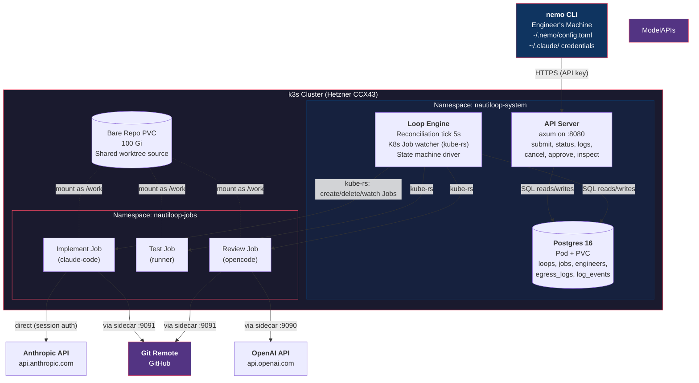

---

## 2. Job Pod Internal Architecture

Each agent job runs as a K8s Job with two containers: the agent (claude-code or opencode) and an auth sidecar. The agent never sees raw credentials. All external traffic routes through the sidecar via localhost.

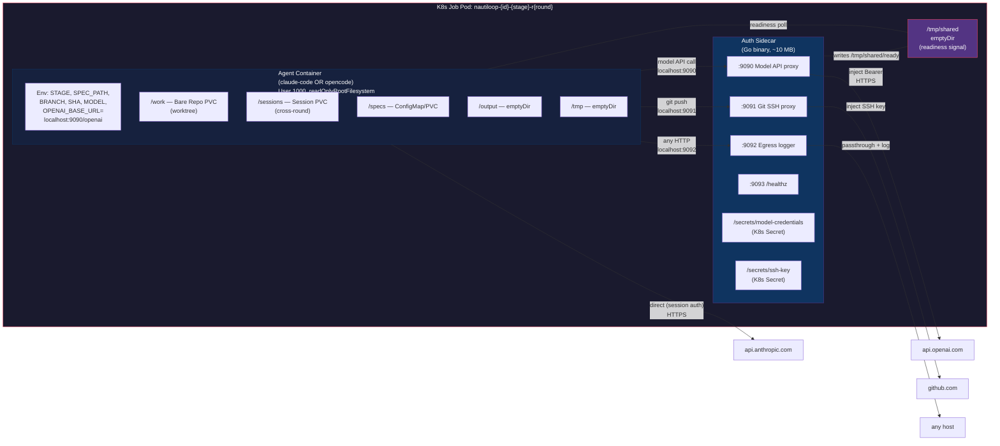

---

## 3. Full Loop Lifecycle

The complete flow from `nemo start --harden` through spec hardening, engineer approval, implementation rounds, and convergence to a PR.

```mermaid
sequenceDiagram
    participant E as Engineer
    participant API as API Server
    participant PG as Postgres
    participant LE as Loop Engine
    participant K8s as K8s / Agent Pods

    E->>API: nemo start --harden spec.md
    API->>PG: INSERT loop (state=PENDING, harden=true)
    API-->>E: 201 {loop_id, branch}

    Note over LE,PG: Reconciliation tick (<=5s)
    LE->>PG: Read PENDING loop

    rect rgb(30, 40, 70)
        Note over LE,K8s: HARDENING PHASE
        loop Harden rounds (until audit clean)
            LE->>PG: stage=SPEC_AUDIT, sub=DISPATCHED
            LE->>K8s: Create Job (audit, openai)
            K8s-->>LE: Job watcher: RUNNING
            LE->>PG: sub=RUNNING
            K8s-->>LE: Job watcher: SUCCEEDED
            LE->>PG: sub=COMPLETED
            Note over LE: Parse audit verdict

            alt verdict.clean == false
                LE->>PG: stage=SPEC_REVISE, sub=DISPATCHED
                LE->>K8s: Create Job (revise, claude)
                K8s-->>LE: SUCCEEDED
                LE->>PG: sub=COMPLETED, round++
            else verdict.clean == true
                Note over LE: Hardening converged
            end
        end
    end

    LE->>PG: state=AWAITING_APPROVAL

    E->>API: nemo approve {loop_id}
    API->>PG: approve_requested=true
    API-->>E: 200 OK

    Note over LE,PG: Reconciliation tick

    rect rgb(40, 30, 60)
        Note over LE,K8s: IMPLEMENTATION PHASE
        loop Implement rounds (until review clean)
            LE->>PG: stage=IMPLEMENTING, sub=DISPATCHED
            LE->>K8s: Create Job (implement, claude)
            K8s-->>LE: SUCCEEDED
            LE->>PG: sub=COMPLETED

            LE->>PG: stage=TESTING, sub=DISPATCHED
            LE->>K8s: Create Job (test)
            K8s-->>LE: SUCCEEDED
            LE->>PG: sub=COMPLETED

            alt tests failed
                Note over LE: Feed test failures to next round
            else tests passed
                LE->>PG: stage=REVIEWING, sub=DISPATCHED
                LE->>K8s: Create Job (review, openai)
                K8s-->>LE: SUCCEEDED
                LE->>PG: sub=COMPLETED

                alt verdict.clean == false
                    Note over LE: Write feedback file, round++
                else verdict.clean == true
                    Note over LE: Create PR
                end
            end
        end
    end

    LE->>PG: state=CONVERGED
    E->>API: nemo status
    API-->>E: CONVERGED, PR #42
```

---

## 4. State Machine

All loop states, sub-states, transitions, and terminal states. Interrupt states (PAUSED, AWAITING_REAUTH, CANCELLED) are reachable from any active state.

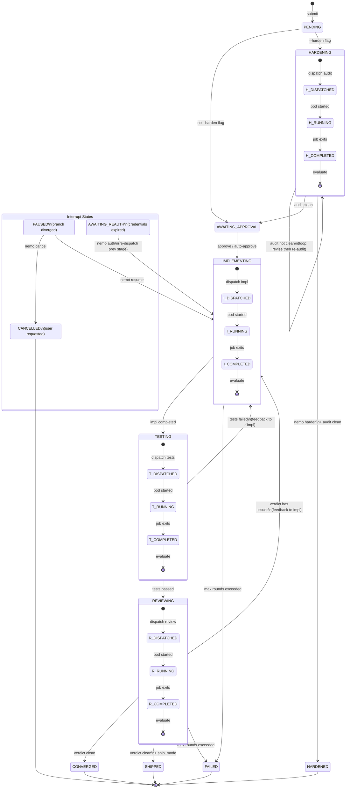

---

## 5. Control Plane Communication

The API Server and Loop Engine share NO direct RPC. Postgres is the only shared medium. The Loop Engine uses a `select!` over a 5s ticker and a K8s Job watcher channel.

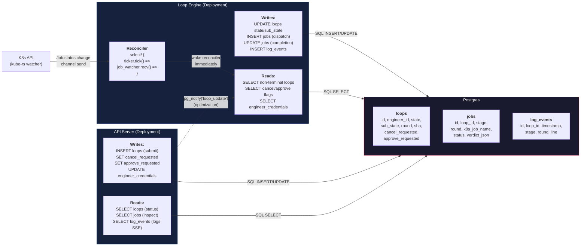

---

## 6. Config Resolution

Three config layers merge with increasing priority. CLI flags are the highest-priority override, applied per-request. Engineer values are capped by cluster limits.

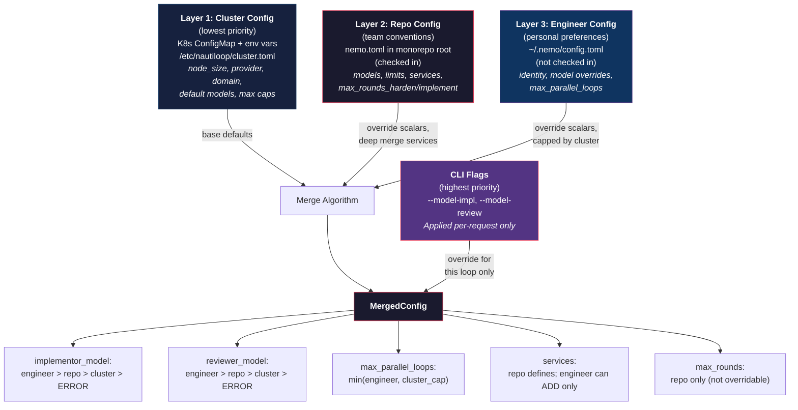

---

## 7. Git Worktree Lifecycle

The full lifecycle of a worktree: mutex-protected creation, job execution, and mutex-protected cleanup. The mutex serializes all git worktree operations to avoid file lock contention.

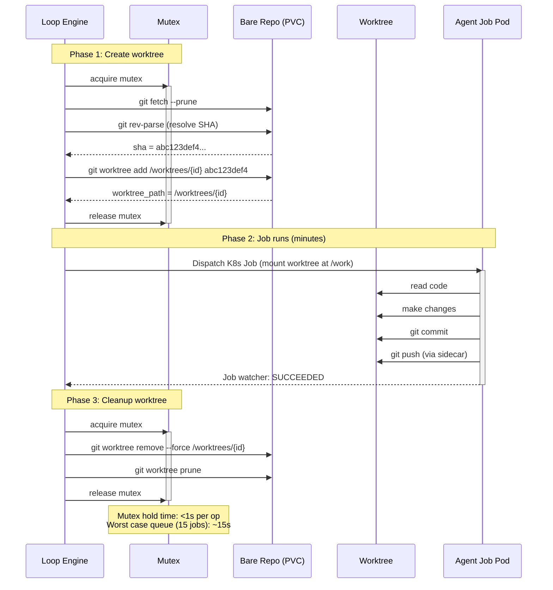

---

## 8. Auth Flow

Credentials flow from the engineer's machine into K8s Secrets, are mounted only into the auth sidecar, and are injected into outbound requests. The agent container never sees raw credentials.

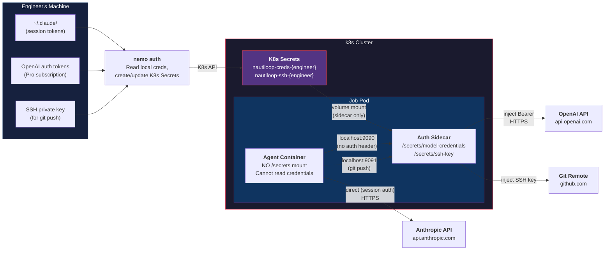

---

## 9. Retry and Error Handling

Decision tree for all failure scenarios. Each failure type has a specific retry policy and terminal condition.

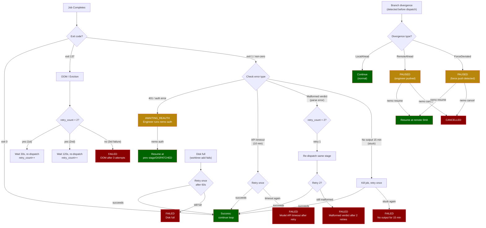

---

## 10. Engineer Workflow (Pitch Diagram)

How an engineer uses Nautiloop day-to-day. This is the product from the user's perspective.

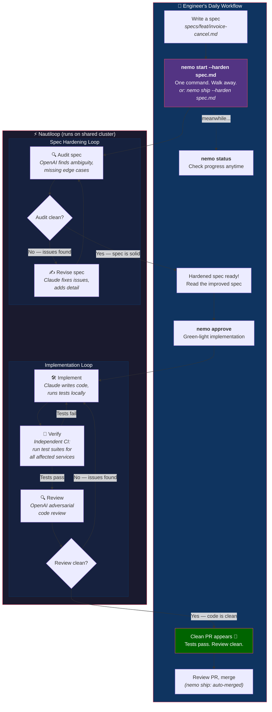

---

## 11. Parallel Execution (Team View)

What it looks like when a team of 3 engineers is using Nautiloop simultaneously. Each engineer runs up to 5 parallel loops on shared infrastructure.

```mermaid
gantt
    title Nautiloop: 3 Engineers × 5 Parallel Loops
    dateFormat HH:mm
    axisFormat %H:%M

    section Alice
    feat/invoice-cancel (harden)       :a1, 09:00, 20min
    feat/invoice-cancel (implement)    :a1b, after a1, 45min
    fix/budget-overflow (implement)    :a2, 09:05, 30min
    feat/reporting (harden)            :a3, 09:10, 25min
    feat/reporting (implement)         :a3b, after a3, 50min
    feat/export-pdf (implement)        :a4, 09:15, 35min

    section Bob
    feat/tracker-extract (implement)   :b1, 09:00, 40min
    spec/campaign-pause (harden)       :b2, 09:05, 30min
    fix/auth-token (implement)         :b3, 09:20, 25min

    section Eve
    refactor/auth-middleware (implement) :e1, 09:00, 60min
    feat/notifications (harden)         :e2, 09:10, 20min
    feat/notifications (implement)      :e2b, after e2, 40min
```

---

## 12. The Convergent Loop (Core Primitive)

The single primitive that powers everything in Nautiloop. Both spec hardening and implementation are instances of this same loop.

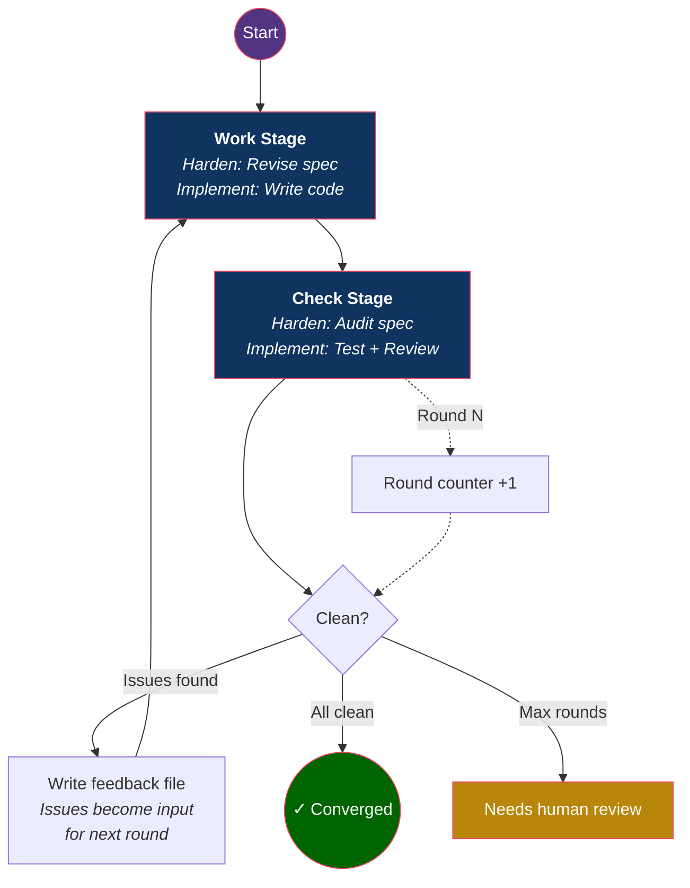

**Key insight:** The loop doesn't run a fixed number of times. It runs until the adversarial check finds nothing wrong. The exit condition is quality, not iteration count.
